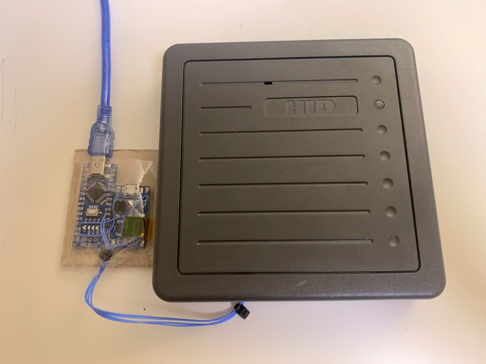
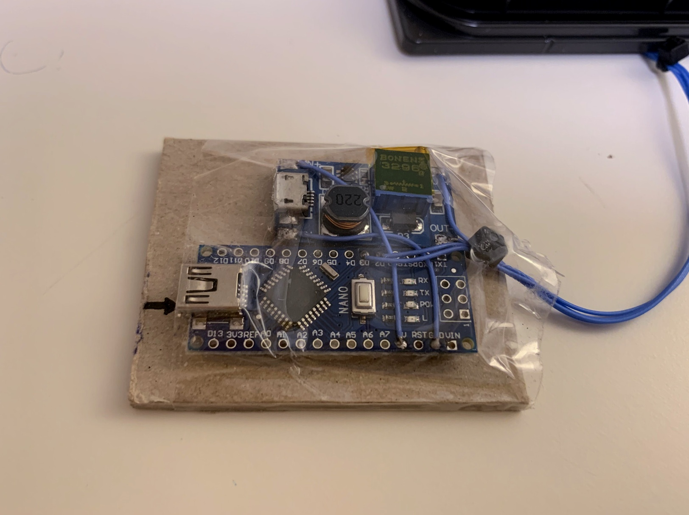
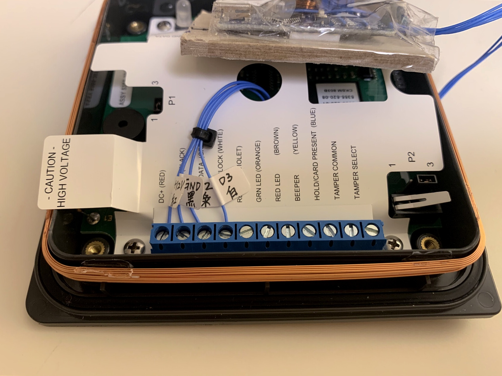
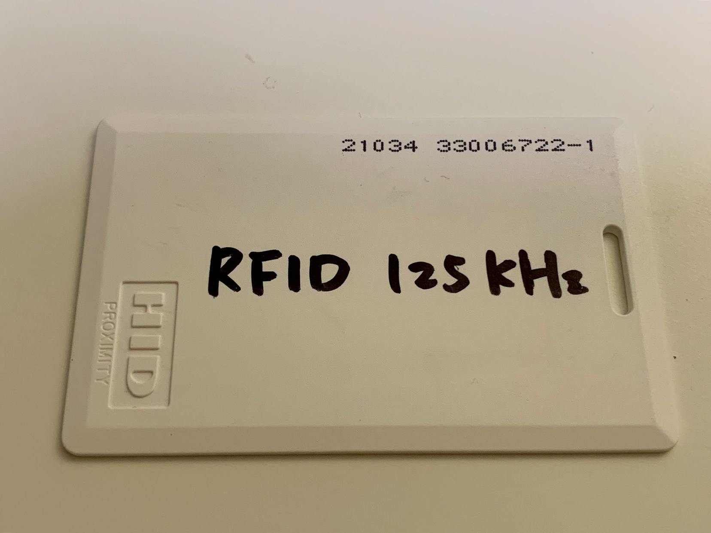

# Arduino_HID_Card_Reader  

## 成品如下  






## 材料  
(1) Arduino Nano  
(2) 升壓板 (5V->12V)  
(3) HID Card Reader  


## Wiring  
```
D2  ----------------- DATA0 (DATA)  (Green)
D3  ----------------- DATA1 (CLOCK) (WHITE)
5V  -- (升壓板 12V) -- DC+           (Red)
GND -- (升壓板 GND) -- GND           (Black)
```


## 參考網址  
https://create.arduino.cc/projecthub/shakataganai/hid-prox-rfid-to-arduino-bd9b8a


