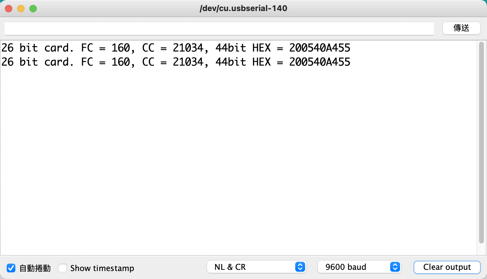

# Arduino_HID_Card_Reader  

## 成品如下  

## 材料  
(1) Arduino Nano  
(2) 升壓板 (5V->12V)  
(3) HID Card Reader

## 參考網址  
https://create.arduino.cc/projecthub/shakataganai/hid-prox-rfid-to-arduino-bd9b8a

